<div align="center">


</div>

<div align="center">

<!-- Animated Typing -->
<a href="https://git.io/typing-svg"></a>

<!-- Animated Badges -->
<p>
  
  
  
</p>

</div>

---


### 🎯 WHO AM I

```typescript
interface Developer {
  name: string;
  role: string;
  expertise: string[];
  mindset: string;
}

const SimonMax: Developer = {
  name: "Simon Max",
  role: "Full-Stack Engineer",
  expertise: [
    "Modern Web Architecture",
    "Scalable Backend Systems", 
    "Pixel-Perfect Frontends",
    "Database Optimization"
  ],
  mindset: "Ship fast. Build smart. Scale seamlessly."
};

export default SimonMax;
```

<br clear="right"/>

---

## 🧰 TECHNOLOGY STACK

<table>
<tr>
<td width="50%" valign="top">

### 🎨 Frontend Universe
```javascript
const frontend = {
  core: ["HTML5", "CSS3", "JavaScript ES6+"],
  frameworks: ["React", "Angular"],
  styling: ["TailwindCSS", "Sass", "Styled-Components"],
  animations: ["Framer Motion", "GSAP"],
  building: "Responsive, Fast, Beautiful"
}
```

<p>
  
</p>

</td>
<td width="50%" valign="top">

### ⚙️ Backend Powerhouse
```javascript
const backend = {
  runtime: ["Node.js", "PHP"],
  frameworks: ["Express", "Nest.js"],
  databases: ["PostgreSQL", "MySQL"],
  apis: ["REST", "GraphQL"],
  focus: "Performance, Security, Scale"
}
```

<p>
  
</p>

</td>
</tr>
</table>

---

## 📈 GITHUB METRICS

<div align="center">


</div>

<div align="center">
  
  
</div>

<div align="center">
  
  
</div>

---

## 🎯 WHAT DRIVES ME

<table>
<tr>
<td width="25%" align="center">

<br><strong>Ship Fast</strong>
<br><sub>MVP to Production</sub>
</td>
<td width="25%" align="center">

<br><strong>Clean Code</strong>
<br><sub>Maintainable & Scalable</sub>
</td>
<td width="25%" align="center">

<br><strong>Performance</strong>
<br><sub>Optimized & Lightning Fast</sub>
</td>
<td width="25%" align="center">

<br><strong>UX First</strong>
<br><sub>User-Centric Design</sub>
</td>
</tr>
</table>

---

## 🔥 CURRENT FOCUS

```mermaid
graph LR
    A[Learning] -->|AI Integration| B[Next.js 14+]
    A -->|Real-time| C[WebSockets]
    A -->|Cloud| D[AWS/Vercel]
    B --> E[Modern Apps]
    C --> E
    D --> E
    E -->|Deploy| F[🚀 Production]
```



<div align="center">

### 🌟 Building the next generation of web experiences

</div>

---

## 💼 LET'S BUILD SOMETHING AMAZING

<div align="center">

[](YOUR_PORTFOLIO_URL)
[](YOUR_LINKEDIN_URL)
[](YOUR_TWITTER_URL)
[](mailto:YOUR_EMAIL)

<br>

### 📫 Open to collaborations, freelance, and exciting projects!

</div>

---

<div align="center">

### 💎 "Code is art. Execution is everything."


<sub></sub>

</div>
